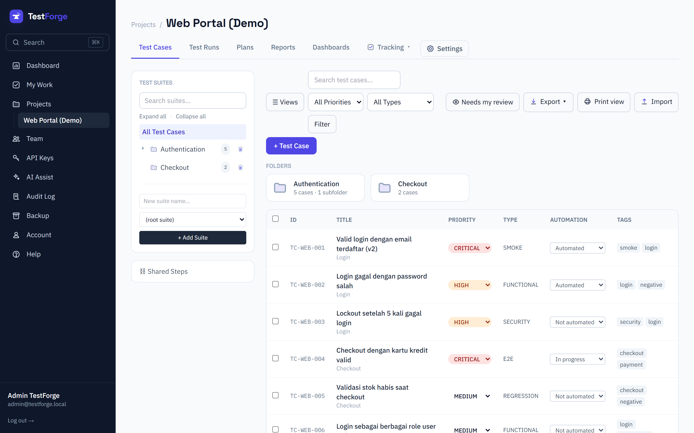
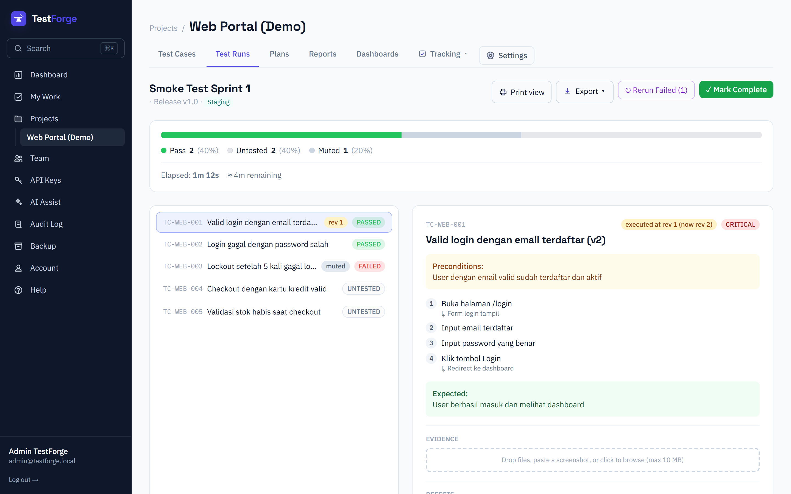
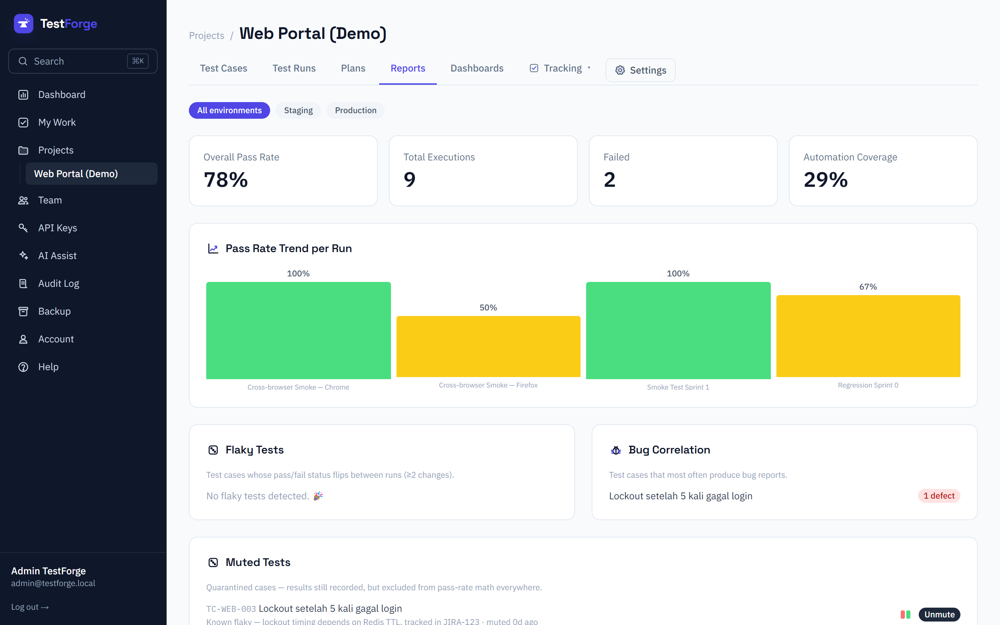

# ⚒️ TestForge

[](LICENSE)
[](https://testforge.emha.space/public/tkpdd)

Open source test case management platform — a free alternative to TestRail,
Qase.io, and Zephyr. Built from **TestForge PRD v1.0** (see
[docs/DOCUMENTATION.md Part II](docs/DOCUMENTATION.md#part-ii--prd-audit) for the audit of that document).

**▶ [See it live — a real project, no sign-up](https://testforge.emha.space/public/tkpdd)** · 116 test cases across 52 suites, read-only.







## What it does

- **Test case management** — suite → section → case hierarchy with steps,
  tags, custom fields, shared steps, versioning and full-text search.
- **Test runs** — build a run from a filter, execute it with keyboard
  shortcuts and a live timer, rerun only what failed, compare two runs.
- **Automation integration** — upload JUnit/TRX/NUnit/xUnit/Cucumber/Mocha
  results, or stream live runs from Playwright, Cypress, pytest and the CLI.
- **CI quality gates** — a per-project pass-rate policy your pipeline can
  block on, plus an embeddable live quality badge.
- **Cases as code** — sync a `tests/` folder of YAML with the server so test
  cases get reviewed in pull requests like the rest of your code.
- **QA Academy** (beta) — a free roadmap from zero to professional QA at `/academy`:
  testing fundamentals, manual QA at work, automation, and Foundation Level exam
  prep, practised in a real project ([plan](docs/QA-ACADEMY.md)). Finish a track or
  pass the full practice exam and you get a certificate on a shareable page — a
  record of practice, not a professional qualification.
- **Self-hosted and free** — one `docker compose up`, SQLite or PostgreSQL,
  unlimited users, no per-seat pricing, MIT licensed.

## MVP Features (v0.1)

<details>
<summary><b>Full feature list (45)</b></summary>

- **Multi-project workspace** — create, archive, namespace tests per project
- **Test case management** — all standard PRD §4.2.1 fields, dynamic steps,
  clone, bulk edit, tags, soft delete, automatic ID `TC-[SLUG]-[NUM]`; bulk
  select → drag onto a suite to move or onto another row to reorder, or
  "Copy to project…" to duplicate into another project you belong to
  (fresh IDs, flattened shared steps, duplicated attachments)
- **Suite → section → case hierarchy** (PRD §4.1.2)
- **Test run & execution** — select cases via filter, 7-color status (§4.3.2),
  keyboard shortcuts `P/F/B/S/R` + `J/K` (US-002), automatic timer, partial run,
  **rerun failed only**, milestone
- **Automation integration** — upload results from JUnit, TRX (MSTest), NUnit3,
  xUnit.net v2, Cucumber JSON or Mocha JSON via `POST /api/v1/results` (format
  auto-detected, or `POST /api/v1/junit` for the original JUnit-only alias),
  auto-matching to test cases via `TC-WEB-001` annotation in test name or exact
  title (US-010)
- **REST API v1** — Bearer API key (hashed), cursor pagination, filtering
- **Import/Export CSV** — with preview & validation before import (US-004)
- **Reports** — pass rate trend, flaky test detection, bug correlation,
  automation coverage (§4.5)
- **Live quality badge** — public shields.io-style SVG (`/badge/<token>.svg`)
  showing the latest pass rate / automation coverage / case count, embeddable
  in a README; opt-in per project, revocable token (L-01)
- **Real-time collaborative run execution** — presence avatars, live result
  updates over SSE, soft claims ("Ana is on this case") and last-write-wins
  conflict toasts with Undo; degrades gracefully when the stream is blocked
  (L-04, single-instance scope)
- **CI quality gates** — per-project policy (min pass rate, max new failures
  vs the previous run, block-on-untested, required tags); CI asks
  `testforge-cli gate --wait 600` or `GET /api/v1/projects/<slug>/gate` and
  gets a deterministic, mute-aware verdict with exit code (L-02)
- **Test cases as code (GitOps)** — `testforge-cli cases pull|status|push`
  syncs a `tests/` folder of canonical YAML with the server, so cases get
  reviewed in PRs like code; 3-way merge against a committed
  `.testforge.lock`, conflicts exit 1 with a report instead of overwriting
  (L-03 — see [docs/CASES-AS-CODE.md](docs/CASES-AS-CODE.md))
- **Basic auth & RBAC** — register/login JWT, brute force lockout (§8),
  audit log (§5.5)
- **SSO & two-factor auth** — OpenID Connect single sign-on (any OIDC provider
  via `TF_OIDC_ISSUER`; covers Google Workspace/Azure AD/Okta/Keycloak), plus
  optional per-account TOTP 2FA with single-use recovery codes.
  `TF_DISABLE_PASSWORD_LOGIN=1` makes an instance SSO/social-only.
- **LDAP / Active Directory** — self-hosted instances can authenticate against a
  corporate directory (`TF_LDAP_URL` + `TF_LDAP_BASE_DN`; OpenLDAP and AD both
  work out of the box). Users sign in on the normal login form with their
  directory username or email; `TF_LDAP_AUTO_PROVISION=1` creates the TestForge
  account on first login. Local accounts keep working as a fallback, so a
  directory outage can't lock the admin out. Supports `ldaps://` and StartTLS
  (`TF_LDAP_START_TLS=1`); TOTP 2FA still applies on top of a directory bind.
- **Attachments** — drag-drop/paste screenshots & files on test cases and run
  results (evidence), sha256-deduplicated storage in the `/data` volume,
  per-file limit via `TF_MAX_UPLOAD_MB` (default 10 MB)
- **Markdown** — GFM in descriptions, preconditions, steps, expected results
  and run notes (sanitized rendering); paste a screenshot into the editor to
  attach & embed it
- **Global search** — `⌘K`/`Ctrl+K` command palette across cases, runs, suites
  and milestones (exact `TC-…` id lookup ranks first), scoped to your projects
- **Saved views** — save case-table filter combos as named views (personal or
  shared with the project), star one as your default
- **Custom fields** — define per-project fields on cases & run results
  (9 types incl. dropdown, multi-select, user, date); enforced in forms,
  CSV import/export (`cf_<key>` columns), and the REST API
- **Shared steps** — reusable step blocks ("Log in as admin") inserted into
  any case; edit once and every case updates, delete only when unused
- **Case history & versioning** — every change becomes a numbered revision
  (author, per-field diff) with one-click restore; run results remember which
  revision they executed and flag stale ones
- **Test plans & configurations** — bundle runs generated from one case
  selection × a configuration matrix (e.g. Browser × OS → 4 runs, max 50),
  with aggregate progress, a per-combo result matrix, and one-click
  complete-plan; configuration axes are managed under Fields
- **Issue tracker integration** — connect Jira, GitHub or GitLab per project;
  file an issue straight from a failed result (steps, expected vs actual and a
  backlink are pre-filled), link existing issues by key or URL, and see live
  status badges refreshed by a sync job. Tokens are encrypted at rest and never
  returned to the browser
- **Notifications** — push run/case events to Slack, Discord, Microsoft Teams
  or email per project (event subscriptions, test button, failure-burst
  aggregation); links use `TF_BASE_URL`, chat webhook URLs are stored
  encrypted (`TF_SECRET`, falls back to `AUTH_SECRET`), and non-standard
  webhook hosts require `TF_ALLOW_ANY_WEBHOOK_HOST=1`
- **In-app help center** — `/docs/help`, a guide per feature area (test
  cases, runs, plans, automation, integrations, notifications, reports, team
  & roles) for end users, separate from the developer-facing `/docs/api`
- **Parameters / datasets** — `{{var}}` placeholders in a case's steps,
  substituted per named dataset row; a run seeds one result per row instead
  of one per case, each tagged with its dataset name
- **Environments** — tag runs with where they executed (Staging, Prod, …);
  `&env=<name>` on an automation upload auto-creates one; filter runs and
  reports by environment
- **Mute / quarantine flaky tests** — quarantine a known-flaky case (reason
  required) from the Reports Flaky panel; its results still record but are
  excluded from pass-rate math everywhere, shown as a separate grey segment
- **Importers** — bring cases in from TestRail (XML), Qase (JSON), or
  TestLink (XML) in addition to CSV; suites are created by path with a
  preview step (counts, sample rows, warnings) before anything is saved
- **Run comparison** — pick any two runs and see them side by side
  (`runs/compare?a=…&b=…`): a per-case table with status in each run and a
  delta arrow, plus a summary of regressions (pass → fail) and fixes
- **Dashboards** — build a per-project grid of report widgets (pass-rate
  trend, status distribution, automation coverage, flaky tests, run velocity,
  Markdown notes); position them on a 4-column grid
- **Public share links** — hand a stakeholder a read-only run or dashboard
  report at `/share/<token>` — no sign-in, no way back into the app, `noindex`;
  create with an optional expiry, copy, or revoke from the run/dashboard page
- **Public project sharing (portfolio mode)** — publish a whole project
  read-only at `/public/<project-slug>`: overview, suite folders and every test
  case, no sign-in, no way back into the app. Toggle the Test Cases section and
  search-engine indexing (`noindex` by default) from Settings → Public sharing
  (F-38). The overview summarizes the project at a glance — latest run, pass-rate
  trend, a year of run activity, priority mix, automation coverage and coverage
  tags — with each panel gated by the section toggle it belongs to (F-42)
- **Scheduled reports** — email a KPI summary (pass rate, executions, top
  failures, link to the full report) daily or weekly to a list of recipients;
  managed under Notifications, sent by the `/api/cron/send-reports` job
- **Exploratory / session-based testing** — run a timeboxed session against a
  charter with a live timer and quick-add notes (`N`/`B`/`Q`/`I` hotkeys for
  Note/Bug/Question/Idea, attachments per note); convert an Idea into a draft
  case or file a Bug straight to your connected issue tracker (F-25)
- **Built-in defects** — a lightweight internal defect tracker (`DF-<SLUG>-<n>`,
  severity, status board OPEN→CONFIRMED→FIXED/WON'T FIX→CLOSED) for teams
  without Jira/GitHub/GitLab; link or report one straight from a failed run
  result, no external tracker required (F-26)
- **BDD / Gherkin** — a case's whole scenario can be authored as one
  Given/When/Then block instead of steps, with syntax-highlighted display;
  import/export `.feature` files (one `Scenario:` per case, tags → tags,
  Feature name → suite), and Cucumber JSON results match by scenario name
  like any other case (F-27)
- **Suite baselines** — snapshot a suite tree (case content + F-05 revision)
  as a named baseline to test an older release in parallel with current
  work; "compare to current" flags what changed, moved, or was deleted; a
  run created "from baseline" pins and renders each case's pinned content,
  not today's edits (F-28)
- **XLSX & JSON export** — export cases/runs as `.xlsx` or full-fidelity
  `.json` (custom fields, steps, datasets; optional per-case revision
  history) alongside the existing CSV/`.feature` exports, all from one
  Export menu; CSV import remembers a per-project column mapping so a CSV
  with different header names only needs mapping once (F-30)
- **My Work** — `/my-work`, a cross-project queue of everything assigned to
  you: results waiting for you in active runs, cases you own, and case
  reviews requested from you; a sidebar badge shows the total (F-31)
- **Case dependencies** — mark a case as requiring another to pass first
  (cycles rejected); in a run, a dependent whose prerequisite just failed
  gets a one-click "Accept — mark BLOCKED" suggestion — never applied
  automatically (F-32)
- **Print & PDF views** — dedicated `/print/*` routes render a clean,
  paginated document (cover with provenance, clickable TOC, cases with
  fully-expanded steps or a run report with pass-rate summary + stacked
  bar); "Save as PDF" comes straight from the browser's print dialog, so
  there's no server-side PDF dependency. Scope the catalog to a suite, a
  saved view, or a single case (F-35)
- **Mobile execution PWA** — installable (manifest, icons, offline fallback
  page via a hand-rolled service worker) with a single-card, thumb-zone
  executor layout on phones. Record results with no signal: they queue in
  IndexedDB and sync automatically when you're back online, with a
  last-write-wins conflict notice so nothing is silently lost (F-36)
- **Responsive on a phone, everywhere** — every route is audited at 375px: the
  suite rail collapses to a tappable "Test Suites" header above the case list,
  wide tables and code samples scroll in their own box instead of panning the
  page, and toolbars wrap. Desktop layout from 768px up is untouched
  (F-43, F-44)
- **AI assist (bring your own key)** — point an org at any Anthropic-compatible
  endpoint (key stored encrypted) to draft test cases from a pasted
  requirement, suggest edge-case steps on a case, and flag near-duplicate
  cases (the duplicate detector is a local title match and needs no key). Every
  AI action is opt-in per click and the features stay hidden until a key is
  configured (F-29)
- **Light / dark theme** — switch the whole app between Light, Dark, or
  System (follows your device) from the sidebar footer, Settings → Account,
  or the landing page header; the choice sticks via a cookie, applies before
  first paint (no flash), and works logged-out too (F-39)
- **Instance console** — a read-only `/superadmin` page listing every
  registered user across all organizations (name, email, role, org, projects,
  verification and 2FA status, signup date) with search and CSV export. It is
  for the person who runs the server, not for tenants: the credential is
  static and comes from the environment, never from a `User` row, and the
  whole route 404s unless it is configured (F-41)

</details>

## Running

### Docker (one-command, PRD §5.4)

```bash
docker compose up
```

### Local development

```bash
npm install
npx prisma db push   # create SQLite database
npm run seed         # demo data + admin account
npm run dev
```

Demo login: `admin@testforge.local` / `admin12345`

> Default database is SQLite for out-of-the-box setup. For production per PRD
> (§5.1, PostgreSQL): change `provider` in `prisma/schema.prisma` to
> `postgresql` and set `DATABASE_URL`.

## Backup & self-hosted migration

Your entire instance (users, projects, cases, runs, API keys, audit log, …)
lives in a single database. To back it up or move to your own server if the
hosted site goes away, see
[docs/SELF-HOSTED-MIGRATION.md](docs/SELF-HOSTED-MIGRATION.md).

## Upload CI/CD results

```bash
# Create a WRITE-scoped API key in Settings → API Keys, then:
curl -X POST "http://localhost:3000/api/v1/results?project=web&name=CI%20Run" \
  -H "Authorization: Bearer <API_KEY>" \
  -H "Content-Type: application/xml" \
  --data-binary @results/junit.xml

# format is auto-detected (junit/trx/nunit3/xunit2/cucumber/mocha); pass
# &format=trx etc. to be explicit. POST /api/v1/junit still works unchanged.
```

### Official reporters & CLI (`packages/`)

npm workspaces + a Python package under `packages/`:

- **`testforge-cli`** — `testforge upload <file> --project <slug>` (wraps the
  results API; env `TESTFORGE_URL` / `TESTFORGE_TOKEN`).
- **`testforge-playwright-reporter`** / **`testforge-cypress-reporter`** —
  stream a live run as tests finish (create → per-test result → complete),
  matching `TC-<SLUG>-<n>` in the test title.
- **`pytest-testforge`** — the same, as a pytest plugin.

Each package has a README with copy-paste setup and is publishable to
npm/PyPI (publishing is a manual step).

## Structure

- `src/app/(app)/` — application pages (dashboard, projects, runs, reports, settings)
- `src/app/actions/` — server actions (data mutations)
- `src/app/api/` — REST API v1, CSV import/export, JUnit upload
- `src/content/` — git-versioned long-form content: `help/` (in-app help center)
  and `academy/` (QA Academy tracks and lessons)
- `prisma/schema.prisma` — data model (including ERD gap fixes from the audit)

## Git & deploy

**Do not commit or push directly to remote `main`.** Every push/merge to
`main` triggers auto-deploy to production (`testforge.emha.space` via
`.github/workflows/deploy.yml`).

Expected workflow:

1. Create a branch from `main` (`feat/...`, `fix/...`, etc.).
2. Push the branch to remote and open a **Pull Request** to `main`.
3. Wait for CI (`prisma generate` + `next build`) to pass.
4. Merge the PR — production deploy runs automatically after merge.

```bash
git checkout main && git pull
git checkout -b fix/short-description
# ... work ...
git push -u origin fix/short-description
# open PR on GitHub → review → merge
```

## Instructions for AI agents

Applies to **Cursor, Claude Code, Copilot**, and other coding agents in this
repo. Follow these rules before changing code, git, or deploy.

### Git & remote

- **Do not** commit or push directly to remote `main` (automatic production
  deploy — see § Git & deploy).
- Required workflow: branch (`feat/...`, `fix/...`) → push branch → PR to `main` → CI
  green → merge.
- **Do not** commit unless the user explicitly asks. **Do not** push to remote
  unless the user explicitly asks.
- **Do not** force-push to `main`/`master`. **Do not** commit `.env`, secrets,
  or `*.db`.

### Scope & code style

- Minimal diff — only change what the task requires; do not refactor unrelated code.
- Follow repo conventions: Next.js 14 App Router, server actions
  (`src/app/actions/`), Prisma + SQLite dev, Tailwind, i18n EN/ID.
- Do not add `.md` documentation files unless the user asks.

### Production & build

- Production: `testforge.emha.space` · VPS `/opt/testforge` ·
  `docker-compose.prod.yml` · deploy via `.github/workflows/deploy.yml`.
- `NEXT_PUBLIC_*` variables are **baked at Docker build time** — change them in
  `docker-compose.prod.yml` (and rebuild), not only as fallbacks in TSX code.
- **GitHub links for visitors** (clone, Star on GitHub) now point at the real
  repo `mansyur007/testforge`, same as dev/CI. The former decoy
  `mansyur007/test-forge` still exists on GitHub but is no longer referenced
  from this source tree.

### Project context

- `docs/DOCUMENTATION.md` — the consolidated project documentation: application audit
  (architecture, auth, user flows), PRD audit, competitor comparison, and the full
  implementation work orders for all 42 shipped features.
- EMHA estate deploy skill (VPS, Caddy): `.claude/skills/` — local, gitignored;
  brief guide in § Git & deploy and the deploy workflow.

License: MIT
